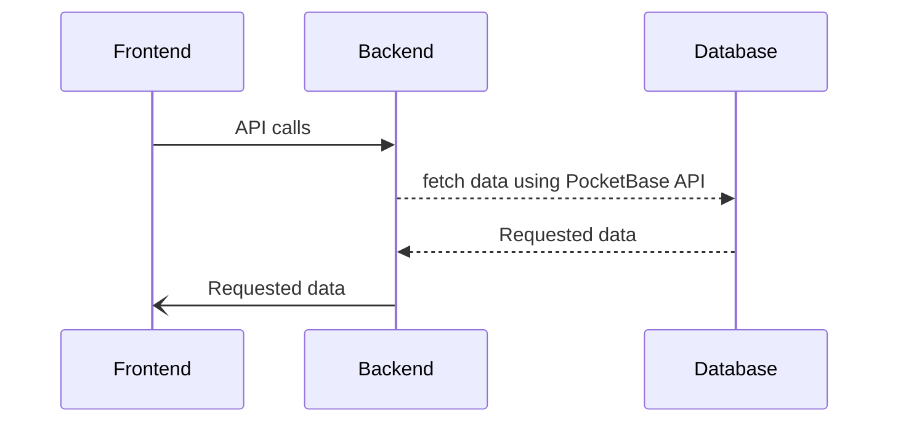

Markopolis is built using 2 frameworks: [sveltekit](https://svelte.dev) and [pocketbase](https://pocketbase.docs).
Pocketbase is used for database and the backend API is implemented using sveltekit. It additionally has a
client side convenience python CLI interface.
The sveltekit webapp exposes APIs for interaction, pre-renders and routes the websites. The functionality of the
app begins with the python CLI interface. Running the sync command uploads files using an API. The API on
recieving the file, converts it to html and stores it in the database along with the original file.
The sveltekit app then uses dynamic routing to search and fetch the file from the database and renders it as a
webpage.

On the high-level Markopolis consists of a backend and a database. The front-end interacts with the backend
and requests things needed to render pages. The backend, according to the requests, pulls data from the database
and returns them.
The front-end interacts with the backend via REST APIs exposed by the backend and for webpages also uses
Server Side Rendering(SSR). Below is a diagram illustrating the data and control flow:

## Backend

The backends primary function is
