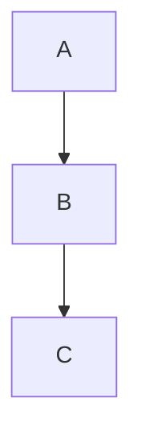
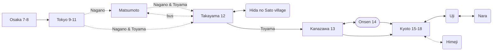

# Headings

```markdown
# Heading 1
## Heading 2
### Heading 3
#### Heading 4
##### Heading 5
```


# Heading 1
## Heading 2
### Heading 3
#### Heading 4
##### Heading 5

## Horizontal line

---

## Images

### embed images
Image names should be unique. Duplicate images will be overwritten.

```markdown
![[image.png]]
```

![[image.png]]

### external images

```markdown

```


## Wikilinks

```markdown
[[Installation]]
[[f1/test]]
[[f2/test]]
```

[[Installation]]
[[f1/test]]
[[f2/test]]

## Text formatting
```
**Bold text**
*Italic text*
~~this puts a strikethrough~~
==this highlights text==
**Bold text and _nested italic_ text**
***Bold and italic text***
```

**Bold text**
*Italic text*
~~this puts a strikethrough~~
==this highlights text==
**Bold text and _nested italic_ text**
***Bold and italic text***

## Footnotes

```markdown
This is a simple footnote[^1].


[^1]: This is the referenced text.
[^2]: Add 2 spaces at the start of each new line.
  This lets you write footnotes that span multiple lines.
[^note]: Named footnotes still appear as numbers, but can make it easier to identify and link references.
```

This is a simple footnote[^1].


## Quotes

```markdown
> Human beings face ever more complex and urgent problems, and their effectiveness in dealing with these problems is a matter that is critical to the stability and continued progress of society.

\- Doug Engelbart, 1961
```

> Human beings face ever more complex and urgent problems, and their effectiveness in dealing with these problems is a matter that is critical to the stability and continued progress of society.

\- Doug Engelbart, 1961

## Tables

```
| First name | Last name |
| ---------- | --------- |
| Max        | Planck    |
| Marie      | Curie     |
```

| First name | Last name |
| ---------- | --------- |
| Max        | Planck    |
| Marie      | Curie     |

The vertical bars on either side of the table are optional.

Cells don't need to be perfectly aligned with the columns. Each header row must have at least two hyphens.

```markdown
First name | Last name
-- | --
Max | Planck
Marie | Curie
```

First name | Last name
-- | --
Max | Planck
Marie | Curie

## Mermaid diagrams

Some text.





## Callouts

> [!abstract]
> Lorem ipsum dolor sit amet

> [!info]
> Lorem ipsum dolor sit amet

> [!todo]
> Lorem ipsum dolor sit amet

> [!tip]
> Lorem ipsum dolor sit amet

> [!success]
> Lorem ipsum dolor sit amet

> [!question]
> Lorem ipsum dolor sit amet

> [!warning]
> Lorem ipsum dolor sit amet

> [!failure]
> Lorem ipsum dolor sit amet

> [!danger]
> Lorem ipsum dolor sit amet

> [!bug]
> Lorem ipsum dolor sit amet

> [!example]
> Lorem ipsum dolor sit amet

> [!quote]
> Lorem ipsum dolor sit amet

> [!tip] Title-only callout

### Foldable callouts

You can make a callout foldable by adding a plus (+) or a minus (-) directly after the type identifier.

A plus sign expands the callout by default, and a minus sign collapses it instead.

> [!faq]-
> Are callouts foldable?
> Yes! In a foldable callout, the contents are hidden when the callout is collapsed.

[^1]: This is the referenced text.
[^2]: Add 2 spaces at the start of each new line.
  This lets you write footnotes that span multiple lines.
[^note]: Named footnotes still appear as numbers, but can make it easier to identify and link references.
